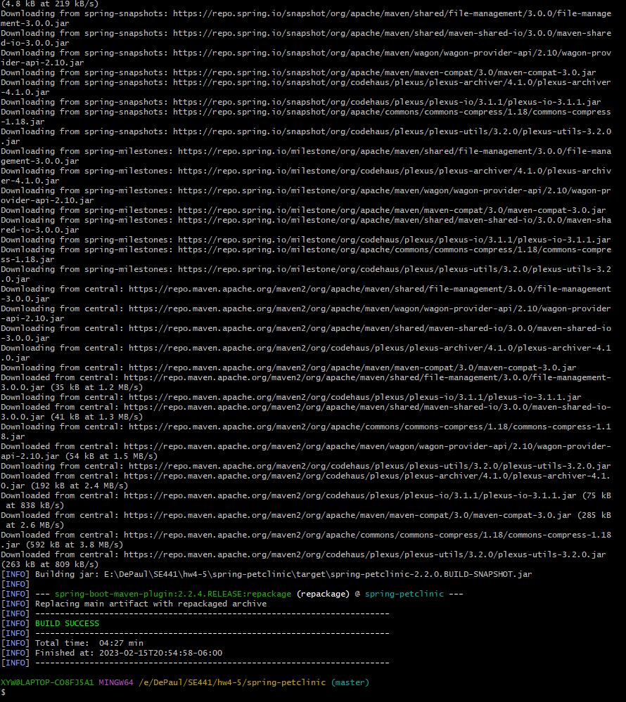
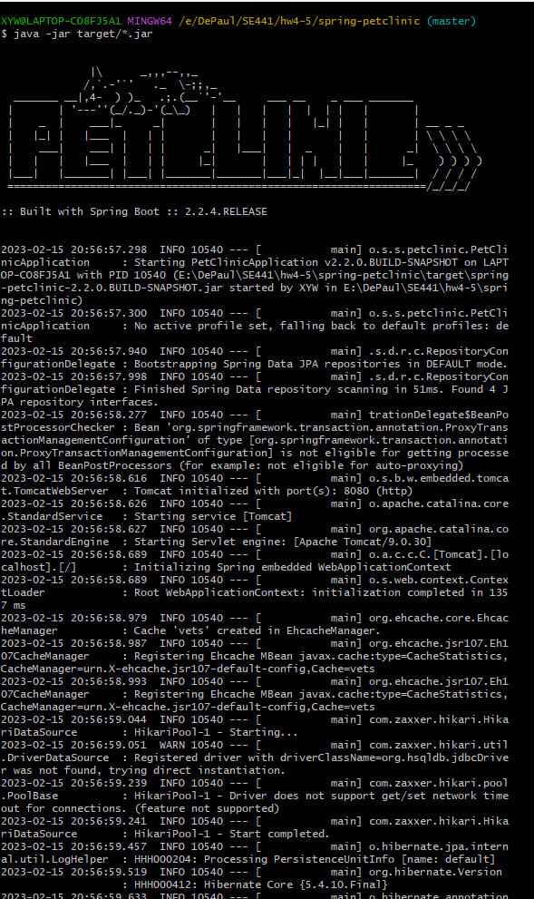
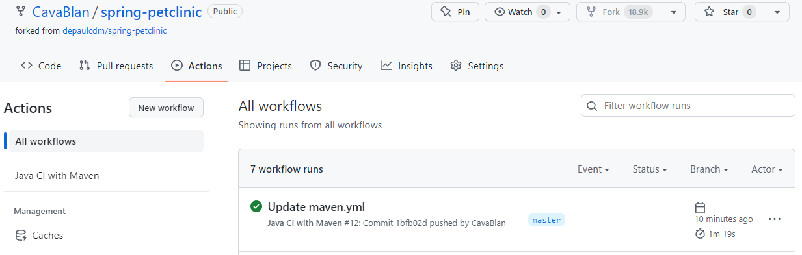
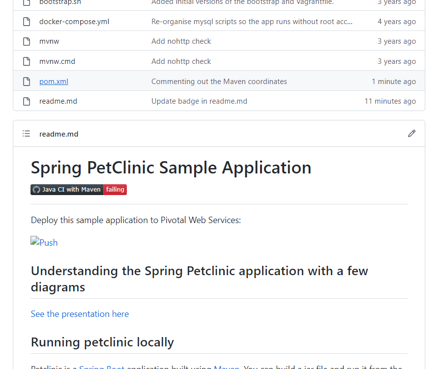

**TODO:** Youwen Xiao 1985668

- Your GitHub account showing that is has been forked from the depaulcdm/springpetclinic repository.

- Your GitHub Actions dashboard showing a successful first build.

- Your GitHub repository with the readme.md file selected showing the code that youchanged to update the badge.

- Your GitHub repository with the readme.md file selected showing the build success status after you’ve updated the badge markdown.

- The section of the POM file showing the coordinates after you’ve commented them out.

- Your GitHub Actions dashboard showing the unsuccessful build after the breaking change.

- Your GitHub repository with the readme.md file selected showing the build failed status after the GitHub workflow fails.

- The section of the POM file showing the coordinates after you’ve fixed them.

- Your GitHub Actions dashboard showing the successful build after the breaking change has been fixed.

- Your GitHub repository with the readme.md file selected showing the build success status after the GitHub workflow has recovered.
